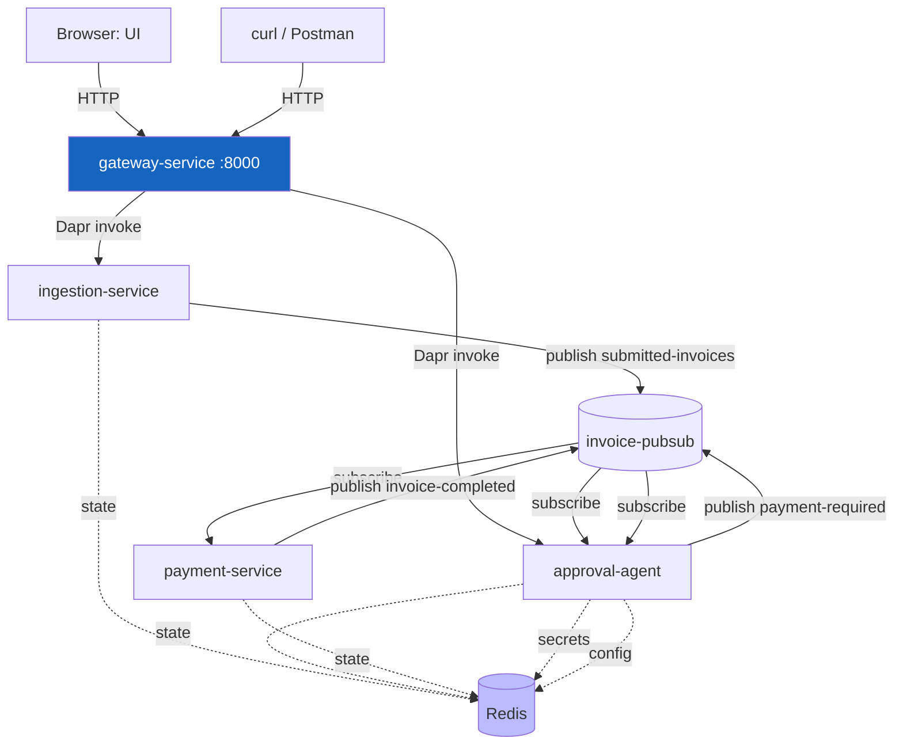
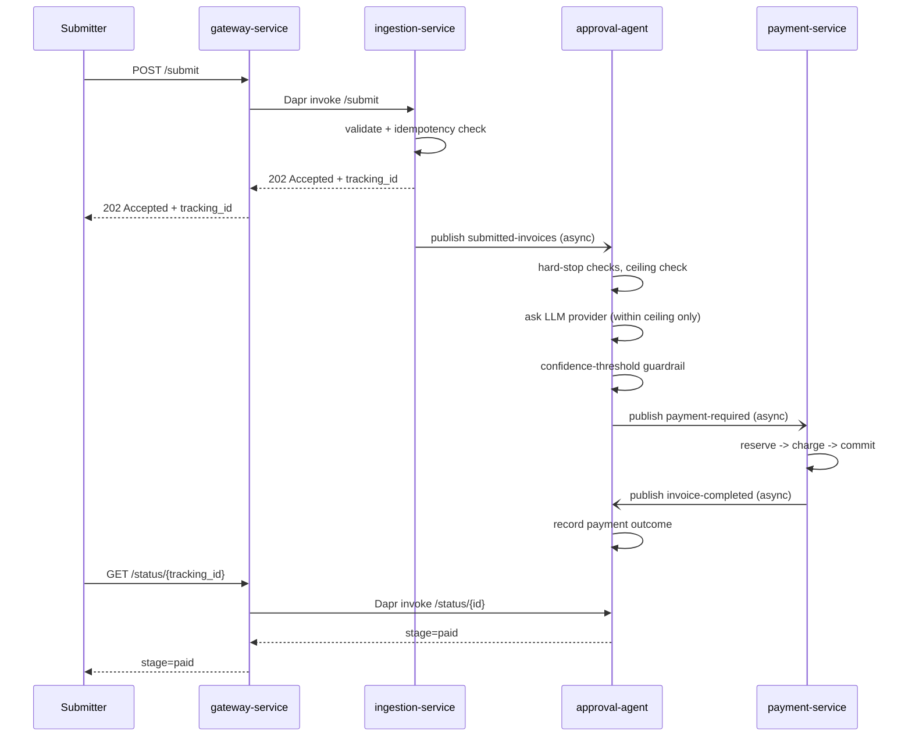
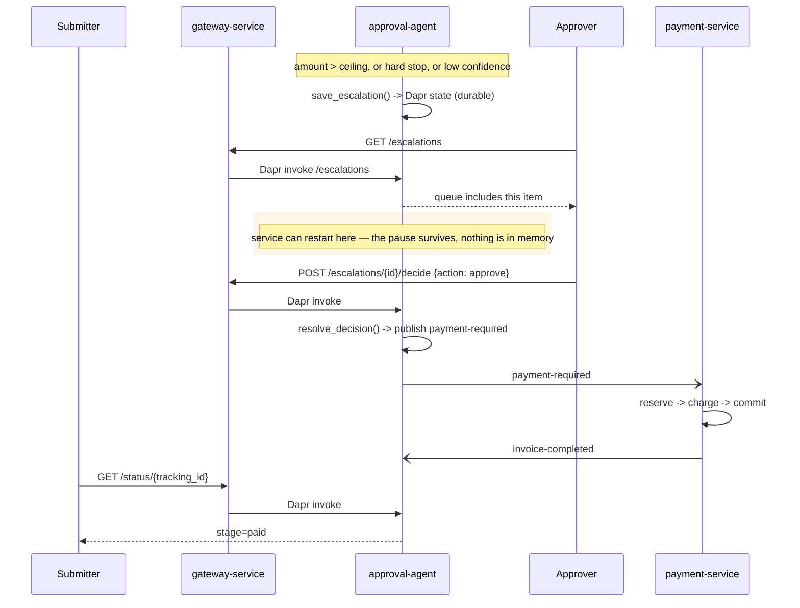
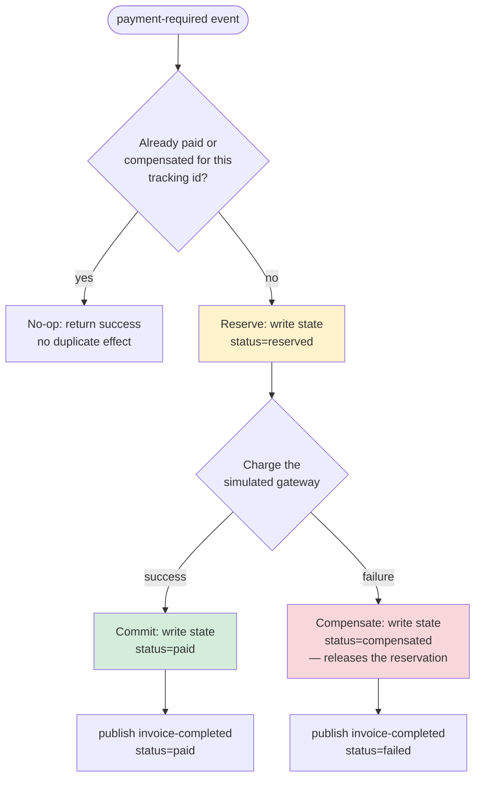

# ApprovalFlow — Architecture

This document describes the system architecture: the services, how they communicate, the
payment saga and its compensation path, and the human-in-the-loop escalation flow.

## System components

| Service | Role | Port (host) |
|---|---|---|
| **gateway-service** | Single external entry point. Rate-limits requests and forwards them to `ingestion-service` / `approval-agent` over Dapr's synchronous service-invocation API. Nothing else is exposed to the host. | 8000 |
| **ingestion-service** | Accepts a submission, validates it, checks/records an idempotency fingerprint, and publishes it for evaluation. Returns immediately (202 Accepted + tracking id) — never blocks on processing. | internal only |
| **approval-agent** | Subscribes to submitted invoices, applies deterministic hard-stop/ceiling checks, asks an LLM provider for a recommendation, enforces the autonomy ceiling and confidence threshold regardless of what the LLM says, and either publishes a payment request or durably escalates to a human. Also exposes the escalation queue, decision, and status endpoints. | internal only |
| **payment-service** | Subscribes to payment-required events and runs a reserve → charge → commit saga, compensating (releasing the reservation) on a failed charge. Idempotent per tracking id. | internal only |
| **ui** | React + MUI single-page app: a Submitter view (submit + check status) and an Approver view (escalation queue + decide). Talks to the gateway only. | 3000 |
| **redis** | Backs Dapr's state store, pub/sub broker, and configuration store. | internal only |
| **Dapr sidecars** (`*-dapr`) | One per service. Handle state, pub/sub, service invocation, configuration, and secrets — application code never talks to Redis directly. | internal only |

Every service-to-service call goes through a Dapr sidecar; there is no direct HTTP between
application containers. The gateway is the only service reachable from outside Docker's network
besides the UI.

### Dapr building blocks in use

- **State**: idempotency fingerprints, invoice evaluations, escalation records, the escalation
  queue, and payment saga state — all in the `statestore` Redis-backed component.
- **Pub/Sub**: `submitted-invoices` → `payment-required` → `invoice-completed`, all on the
  `invoice-pubsub` component.
- **Service invocation**: the gateway calls `ingestion-service` and `approval-agent` synchronously
  through their sidecars (`/v1.0/invoke/<app-id>/method/<path>`).
- **Configuration**: the expense policy and autonomy thresholds live in the `configstore`
  component (seeded from `config/policy.json`'s values), so they can change without a redeploy.
- **Secrets**: `GROQ_API_KEY` is read by approval-agent through the `local-secret-store`
  component (`secretstores.local.env`) rather than a plain environment variable in application
  code.

## Component diagram

## Sequence: auto-approve journey (the "boring 80%")

## Sequence: escalate-and-resume journey (the "other 20%")

## Payment flow: saga with compensation

Payment is a 3-step saga with one compensating action. Every step writes to durable Dapr state
before moving on, so a retry after a crash sees exactly what happened and picks up correctly
instead of double-charging or leaving a dangling reservation.

No reservation is ever left in the `reserved` state: every path from `Reserve` ends at either
`Commit` (paid) or `Compensate` (released). A redelivered event for a tracking id already in a
terminal state (`paid`/`compensated`) is a no-op, verified by `tests/test_payment.py` and by
`scripts/verify.py`'s payment-failure journey.

## The autonomy ceiling — where it's enforced

`approval-agent/agent.py`'s `process_invoice_evaluation` checks the amount against
`autonomy_settings.ceiling_usd` **before** ever calling the LLM provider. If the amount exceeds
the ceiling, the function returns `human_review` immediately — the provider is never invoked, so
there is nothing for a compromised or overly-agreeable model to override. A second guardrail
after the LLM call also downgrades an `approve` recommendation that is somehow over ceiling or
below the confidence threshold, as defense in depth.
`tests/approval_agent/test_ceiling_proof.py` proves this by injecting a provider that always
recommends `approve` at confidence `1.0` and asserting the router still returns `human_review`
for an over-ceiling amount — and that the provider was never even called.

## Idempotency

- **Duplicate submissions** (F3): `ingestion-service` computes a fingerprint from
  `vendor + invoiceNumber + total` and rejects a repeat with `409 Conflict` before it ever reaches
  the rest of the pipeline.
- **Redelivered events**: `payment-service` checks its own state for a terminal status
  (`paid`/`compensated`) before doing anything, so a redelivered `payment-required` event is a
  no-op.
- **Retried decisions**: `approval-agent`'s `resolve_decision` only flips an escalation's status
  to a terminal value as its last step, after the idempotent side effects (publish, queue
  removal) — so retrying a failed decision call is safe.

## Reliability: outbox and bulkhead (N3)

`approval-agent` publishes `payment-required` in two places — the auto-approve path
(`main.py::handle_invoice_event`) and an approver's "approve" decision
(`escalation.py::resolve_decision`). Both used to do a plain "save state, then call Dapr's
publish API" sequence: if the publish call failed or the process crashed in between, the item was
already marked approved with **no durable record that a payment was ever supposed to happen** —
a silent, unrecoverable loss. `outbox.py` closes this with the transactional outbox pattern:

1. `enqueue_with_state` writes the primary state change (the evaluation record, or the
   escalation's "approved" status) **and** a durable outbox record for the event, in one atomic
   Dapr state transaction (`POST /v1.0/state/statestore/transaction`). If this call succeeds,
   both exist; if it fails, neither does.
2. A background poller (`dispatch_pending`, started on `approval-agent`'s startup event, ticking
   every 2s) publishes every pending outbox record. A publish failure just leaves it `pending`
   for the next tick instead of losing it; success marks it `dispatched` and removes it from the
   `outbox_queue` index.

The gateway also caps concurrent in-flight requests per downstream service (`bulkhead.py`,
default 20) — a classic bulkhead: an overloaded `ingestion-service` can't also starve
`approval-agent` calls by consuming all of the gateway's outbound capacity, and a full bulkhead
fails fast with `503` rather than queueing unbounded work.

## Observability (N4)

Dapr auto-instruments its own sidecar-mediated hops (service invocation, pub/sub delivery) once
tracing is enabled (`dapr/components/tracing-config.yaml`, exporting to Jaeger over OTLP). The
app extends that same trace across the two gaps Dapr can't see into on its own:

- **The app's own outbound Dapr calls** — `tracing_setup.py` (per service) extracts the
  `traceparent` Dapr embeds in an incoming CloudEvent envelope (or forwards as a header on a
  service-invocation call), and re-injects it on the next outbound call, so state writes and
  publishes nest under the same trace instead of starting a new one.
- **The LLM call** — `agent.py` wraps the provider call in a child span tagged with the
  correlation id, nested under whichever span is currently active when `process_invoice_evaluation`
  runs.

One wrinkle: the outbox dispatcher (above) publishes on its own timer, so there's no "currently
active" span when it fires. `enqueue_with_state` captures the traceparent at *enqueue* time and
stores it on the outbox record itself; `dispatch_pending` reads it back for that publish.

Result, verified live: submitting one invoice produces a single Jaeger trace with 12 spans across
all 4 services — `gateway -> ingestion-service -> approval-agent (-> llm.evaluate) ->
payment-service -> approval-agent` — viewable at http://localhost:16686.

## Configuration & secrets

- `config/policy.json` is the canonical policy document; its values are seeded into the Dapr
  `configstore` component (via `redis-init` in `docker-compose.yml`) so they're changeable at
  runtime without a redeploy (M13).
- `GROQ_API_KEY` is read through the Dapr `local-secret-store` component rather than a plain
  environment variable in application code (M5).
