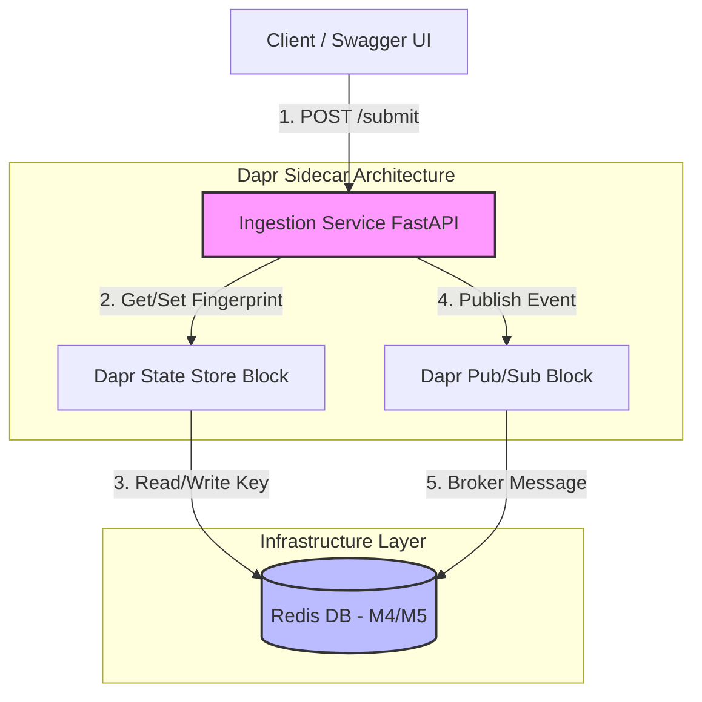

# Project Architecture Documentation

This document describes the high-level system architecture and component design for the Automated Invoice Approval Workflow system powered by **FastAPI** and **Dapr**.

## System Components Overview

The system architecture relies on decoupled microservices that communicate asynchronously using Dapr building blocks (State Management and Publish/Subscribe).

1. **Ingestion Service**: Entry point for all incoming invoices. Validates payload schemas and registers structural idempotency fingerprints.
2. **Dapr Sidecars**: Offloads distributed state holding and pub/sub message brokering topology from application logic.
3. **Redis Store**: Shared backing component serving simultaneously as the transaction persistence layer and communication backbone message broker.

---

## Architecture Component Diagram

Below is the structured topology mapping the runtime flow of an invoice transaction through the platform.



---

## Transaction Lifecycles & Rules

### Phase 1: Structural Validation
* Payload parameters are statically type-checked utilizing strict Pydantic parsing filters inside the schemas compilation layer.
* Invoices containing empty parameters, malformed structural bounds, or zero/negative monetary counters are dropped before ingestion processing.

### Phase 2: Idempotency Verification (```GLOBAL-DUP```)
* Unique transaction fingerprint signatures are evaluated against the centralized cache. 
* Duplicated identifiers matching identical criteria instantly prompt a ```409 Conflict``` resolution response.