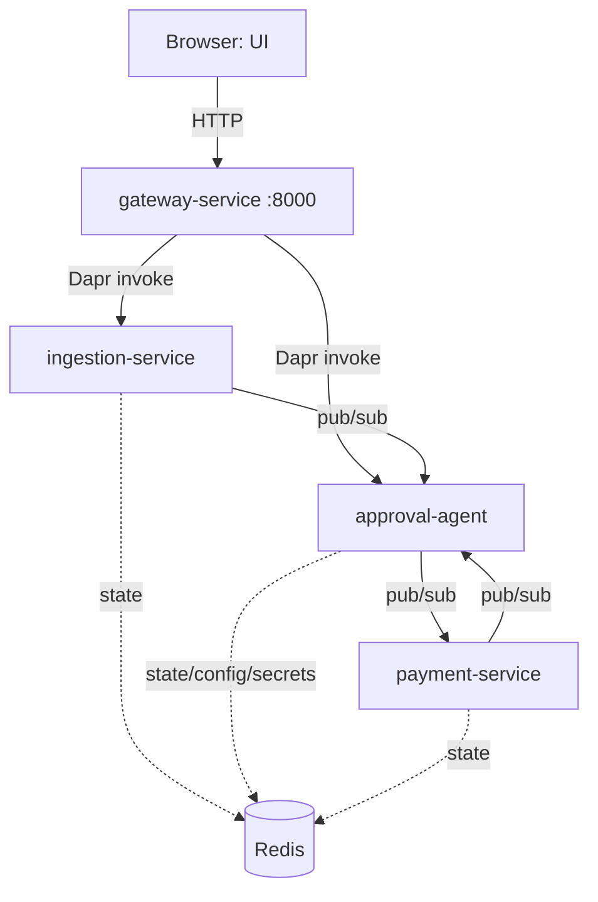

# ApprovalFlow

A microservice-based, AI-assisted invoice & expense approval platform. It ingests
invoices/expenses, judges them against a company policy with an LLM agent, auto-approves the
in-policy majority, and durably escalates the rest to a human — with every decision fully
auditable and a hard, provable ceiling on what the agent may ever approve on its own.

See [ARCHITECTURE.md](ARCHITECTURE.md) for the full component/sequence/payment-flow diagrams.

## Technologies used

- **Python 3.11** + **FastAPI** for every backend service
- **Dapr** for service invocation (sync), pub/sub (async), state, configuration, and secrets
- **Redis** as the backing store for Dapr's state, pub/sub, and configuration components
- **React + MUI (Material UI)**, built with Vite, served by nginx, for the minimal UI
- **Groq** (Llama 3.3) as the default LLM provider, swappable via `LLM_PROVIDER` (a deterministic
  stub provider is used in CI and available for offline development)
- **Docker Compose** to run the whole system with one command
- **GitHub Actions** for CI (lint + tests + a docker-compose build check)
- **pytest** / **pytest-asyncio** for automated tests

## System diagram



(Full sequence diagrams for the auto-approve and escalate-and-resume journeys, plus the payment
saga/compensation flow, are in [ARCHITECTURE.md](ARCHITECTURE.md).)

## Running locally

**Requirements:** Docker Desktop (with Docker Compose), and on Windows, WSL2.

1. Copy `.env.example` to `.env` and fill in a free Groq API key (get one at
   https://console.groq.com/keys) — or set `LLM_PROVIDER=stub` in `.env` to run entirely offline
   with a deterministic fake provider.
2. From the repo root:

   ```bash
   docker compose up -d --build
   ```

3. Open the UI at http://localhost:3000, or call the API directly at http://localhost:8000
   (e.g. `POST /submit`, `GET /status/{tracking_id}`, `GET /escalations`).
4. Tear down with `docker compose down`.

Only the gateway (`:8000`) and the UI (`:3000`) are exposed to the host — every other service is
reachable only through Dapr, inside the compose network.

## Testing

**Unit/integration tests** (mocked Dapr calls, no live stack needed):

```bash
pip install -r services/ingestion_service/requirements.txt \
            -r services/approval_agent/requirements.txt \
            -r services/payment_service/requirements.txt \
            -r services/gateway_service/requirements.txt
PYTHONPATH=. pytest tests/ -v
```

These run automatically in CI on every push (`.github/workflows/ci.yml`), using
`LLM_PROVIDER=stub` so no API key or network access is required.

**End-to-end verification** — brings the stack up, runs the four worked journeys
(auto-approve, escalate-and-resume, duplicate, payment failure + compensation) plus the
anti-cheese guards (at least 2 auto-approvals with no human; a prompt-injection-style note does
not flip an over-ceiling decision) against the live stack, and tears it back down:

```bash
./verify.sh
```

## Autonomy posture (the dilemma)

The agent may auto-approve **only** when the amount is at or below `$250` **and** its confidence
is at or above `0.80` **and** no hard-stop rule applies (unknown vendor, missing receipt, math
mismatch, etc. — see `config/policy.json`). Both the ceiling and confidence checks are enforced
by deterministic code in `approval-agent`, not by trusting the model — see
["The autonomy ceiling"](ARCHITECTURE.md#the-autonomy-ceiling--where-its-enforced) in
ARCHITECTURE.md for exactly where and how, and `tests/test_ceiling_proof.py` for the test that
proves it holds even when the model is forced to recommend approval.
