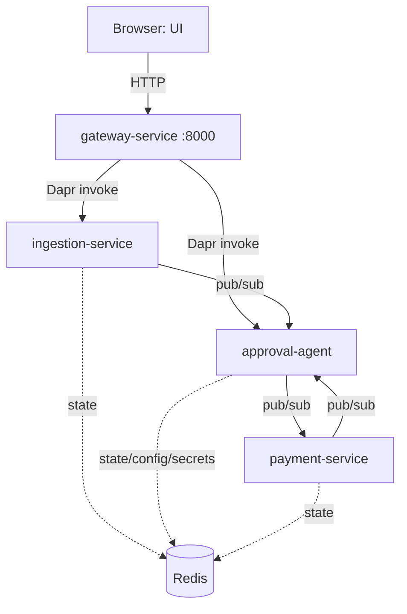

# ApprovalFlow

A microservice-based, AI-assisted invoice & expense approval platform. It ingests
invoices/expenses, judges them against a company policy with an LLM agent, auto-approves the
in-policy majority, and durably escalates the rest to a human — with every decision fully
auditable and a hard, provable ceiling on what the agent may ever approve on its own.

See [ARCHITECTURE.md](ARCHITECTURE.md) for the full component/sequence/payment-flow diagrams.

## Technologies used

- **Python 3.11** + **FastAPI** for every backend service
- **Dapr** for service invocation (sync), pub/sub (async), state, configuration, and secrets
- **Redis** as the backing store for Dapr's state, pub/sub, and configuration components
- **React + MUI (Material UI)**, built with Vite, served by nginx, for the minimal UI
- **Groq** (Llama 3.3) as the default LLM provider, swappable via `LLM_PROVIDER` (a deterministic
  stub provider is used in CI and available for offline development)
- **Docker Compose** to run the whole system with one command
- **GitHub Actions** for CI (lint + tests + a docker-compose build check) and CD (image
  publish + smoke test)
- **pytest** / **pytest-asyncio** for automated tests
- **OpenTelemetry + Jaeger** for distributed tracing — one trace spans the whole submit ->
  evaluate -> pay journey across all 4 services, including the LLM call, tagged with the
  correlation id. Metrics: every Dapr sidecar already exposes a Prometheus-format `/metrics`
  endpoint on `:9090` inside the network.
- **Policy retrieval** — a pure-Python TF-IDF retriever (`policy_rag.py`) selects only the
  policy rules relevant to each invoice for the LLM prompt, instead of embedding the entire
  rulebook on every call.

## System diagram



(Full sequence diagrams for the auto-approve and escalate-and-resume journeys, plus the payment
saga/compensation flow, are in [ARCHITECTURE.md](ARCHITECTURE.md).)

## Running locally

**Requirements:** Docker Desktop (with Docker Compose), and on Windows, WSL2.

1. Copy `.env.example` to `.env` and fill in a free Groq API key (get one at
   https://console.groq.com/keys) — or set `LLM_PROVIDER=stub` in `.env` to run entirely offline
   with a deterministic fake provider.
2. From the repo root:

   ```bash
   docker compose up -d --build
   ```

3. Open the UI at http://localhost:3000 and sign in (see "Authentication" below), or explore/call
   the API directly — **http://localhost:8000/docs** is an interactive Swagger UI grouped
   into Auth/Submissions/Escalations/Status, with example request bodies for every route. Get a
   token from `POST /auth/token`, click **Authorize**, paste it in, and "Try it out" works
   end-to-end. Every route except `/health` and `/auth/*` requires that bearer token.
4. Tear down with `docker compose down`.

Only the gateway (`:8000`) and the UI (`:3000`) are exposed to the host — every other service is
reachable only through Dapr, inside the compose network.

## Authentication

The gateway issues self-signed JWTs via `POST /auth/token` and enforces role-based access on
every route it forwards (`submitter`/`approver`/`admin`). Users are real — persisted in Dapr's
state store with bcrypt-hashed passwords, not a fixed in-memory roster.

**Getting in:**

- **Admin**: the gateway bootstraps one admin account on first startup, from
  `DEFAULT_ADMIN_USERNAME`/`DEFAULT_ADMIN_PASSWORD` in `.env` (defaults: `admin` / `admin123`).
  This is the only way an admin account is ever created — `admin` cannot be self-registered
  (`POST /auth/register` with `role: admin` is rejected with 409).
- **Submitter / approver**: anyone can self-register via `POST /auth/register` (or the UI's
  "Register" link), choosing either role. The account is created **pending** and can't log in
  yet — an existing admin must approve it first, via `GET /auth/pending-users` and
  `POST /auth/users/{username}/decide` (or the UI's Admin tab).

```bash
# 1. Register (starts pending)
curl -X POST http://localhost:8000/auth/register \
  -H "Content-Type: application/json" \
  -d '{"username":"alice","password":"submitter123","role":"submitter"}'

# 2. An admin approves it
curl -X POST http://localhost:8000/auth/token \
  -H "Content-Type: application/json" -d '{"username":"admin","password":"admin123"}'
# -> use the returned access_token as a Bearer token below
curl -X POST http://localhost:8000/auth/users/alice/decide \
  -H "Authorization: Bearer <admin_access_token>" \
  -H "Content-Type: application/json" -d '{"approve": true}'

# 3. Now alice can log in
curl -X POST http://localhost:8000/auth/token \
  -H "Content-Type: application/json" -d '{"username":"alice","password":"submitter123"}'
# -> {"access_token": "...", "token_type": "bearer", "role": "submitter"}
```

Pass the token as `Authorization: Bearer <access_token>` on subsequent requests. The UI's login
screen does this automatically and stores the session in the browser.

## Testing (N6 — three independently runnable layers)

Tests are organized along two axes: **by service** (`tests/approval_agent/`,
`tests/ingestion_service/`, `tests/payment_service/`, `tests/gateway_service/`, plus
`tests/shared/` for the one cross-cutting test), and **by layer**, via pytest markers
(`pytest.ini`) — so `pytest tests/approval_agent/` still finds everything for one service, while
`pytest -m unit` finds everything at one layer, across services.

**Unit** — isolated, mocked-I/O tests of a single module/function (bcrypt/JWT logic, the outbox's
transactional writes, the escalation queue's ETag handling, the TF-IDF retriever, the bulkhead's
concurrency limit, etc.):

```bash
pip install -r services/ingestion_service/requirements.txt \
            -r services/approval_agent/requirements.txt \
            -r services/payment_service/requirements.txt \
            -r services/gateway_service/requirements.txt
PYTHONPATH=. pytest tests/ -m unit -v
```

**Integration** — tests of a service's central orchestrating handler composing several of its own
internal collaborators (the full policy-evaluation pipeline, the payment saga's
reserve→charge→commit/compensate flow, the gateway's `invoke()` + bulkhead) — still with the
Dapr/HTTP boundary mocked, no live stack needed:

```bash
PYTHONPATH=. pytest tests/ -m integration -v
```

Both layers run automatically in CI on every push (`.github/workflows/ci.yml`'s `test` job), using
`LLM_PROVIDER=stub` so no API key or network access is required. `pytest tests/` (no `-m` filter)
runs both together, as before.

**End-to-end** — brings the real stack up with Docker and drives it over HTTP through the
gateway, exactly like a client would: the four worked journeys (auto-approve, escalate-and-resume,
duplicate, payment failure + compensation) plus the anti-cheese guards (at least 2 auto-approvals
with no human; a prompt-injection-style note does not flip an over-ceiling decision):

```bash
./verify.sh
```

This is also its own CI job (`e2e`, separate from `test` since it's slower and needs Docker) —
see `.github/workflows/ci.yml`.

## Autonomy posture (the dilemma)

The agent may auto-approve **only** when the amount is at or below `$250` **and** its confidence
is at or above `0.80` **and** no hard-stop rule applies (unknown vendor, missing receipt, math
mismatch, etc. — see `config/policy.json`). Both the ceiling and confidence checks are enforced
by deterministic code in `approval-agent`, not by trusting the model — see
["The autonomy ceiling"](ARCHITECTURE.md#the-autonomy-ceiling--where-its-enforced) in
ARCHITECTURE.md for exactly where and how, and `tests/approval_agent/test_ceiling_proof.py` for
the test that proves it holds even when the model is forced to recommend approval.

## Reliability extras

- **Transactional outbox** — `approval-agent` never does a plain "save state, then publish"
  sequence for the `payment-required` event. Both the state write and a durable record of the
  event to publish are committed in one atomic Dapr state transaction (`outbox.py`); a background
  poller (`dispatch_pending`, ticking every 2s) delivers it and retries on failure instead of
  ever losing it. This closed two real bugs found while building it: a publish failure after the
  auto-approve state write, and the same gap in the approver's "approve" decision — both used to
  mark the item approved with no record that a payment was ever supposed to happen.
- **Bulkhead** — the gateway (`bulkhead.py`) caps concurrent in-flight requests per downstream
  service (`BULKHEAD_MAX_CONCURRENT_PER_SERVICE`, default 20) so a slow/overloaded
  `ingestion-service` can't also starve calls to `approval-agent` by consuming all outbound
  capacity. A full bulkhead returns `503` immediately rather than queueing. Verified live by
  firing 60 concurrent submissions: exactly 20 succeeded and 40 got `503`.

## Observability

Open **http://localhost:16686** (Jaeger) after submitting anything through the UI or API — search
for the `gateway` service and you'll find one continuous trace for the whole journey:
`gateway -> ingestion-service -> approval-agent (handle_invoice_submission -> llm.evaluate,
tagged with the correlation id) -> payment-service -> approval-agent again` for the payment
outcome. Dapr auto-traces its own sidecar-mediated hops (service invocation, pub/sub delivery);
the app explicitly continues that same trace across the two places Dapr can't see into on its
own — the app's own outbound calls to its sidecar, and the LLM call — by extracting the
`traceparent` Dapr embeds in the CloudEvent envelope (or forwards as an HTTP header) and
re-injecting it on the next outbound call (`tracing_setup.py`, duplicated per service like
`logging_setup.py`). The one asynchronous wrinkle: `approval-agent`'s outbox dispatcher publishes
on its own timer, disconnected from the original request's span, so the trace context is captured
at *enqueue* time and stored on the outbox record itself rather than read from "whatever's
currently active" when the dispatcher later fires.

Metrics: every Dapr sidecar already exposes a Prometheus-format `/metrics` endpoint on `:9090`
inside the compose network (no extra configuration needed) — not scraped/visualized by a
dedicated service here, to keep the stack's memory footprint down.

## Policy retrieval

`approval-agent/policy_rag.py` retrieves only the policy rules relevant to an invoice — scored by
TF-IDF cosine similarity against the invoice's category, notes, and line-item text — instead of
dumping the entire rulebook into every LLM prompt. This scales with the policy handbook rather
than the invoice: a 9-rule policy and a 900-rule one cost the LLM prompt the same amount, since
only the top matches are ever included. The hard-stop and autonomy-ceiling checks are unaffected —
they still run against the *full* policy in code, both before the LLM is asked anything and again
as a guardrail on its answer; retrieval only changes what the LLM sees, never what the router
allows. See ["Policy retrieval"](ARCHITECTURE.md#policy-retrieval) in ARCHITECTURE.md for
the fallback behavior and how it fits into the same trace.

## Continuous Deployment

`.github/workflows/cd.yml` runs after CI finishes successfully on `main` or `dev`
(`workflow_run`, gated on `conclusion == success` — a red CI run is never published):

1. **Build & push** — all 5 service images (`ingestion-service`, `approval-agent`,
   `payment-service`, `gateway-service`, `ui`) are built and pushed to GHCR, tagged with both the
   branch name and `sha-<commit>` for a precise rollback target.
2. **Smoke test** — a separate job then *pulls those exact just-published images* (never rebuilds
   locally) via the `docker-compose.images.yml` overlay, brings the whole stack up from them, and
   polls `/health` on the gateway before tearing down. This is the same "prove it actually runs,
   not just that it compiles" bar used throughout this project — a CD pipeline that only proves an
   image *builds* isn't proof it *deploys*.

To run the published images yourself instead of building locally:

```bash
IMAGE_OWNER=<github-owner-lowercase> IMAGE_TAG=main \
  docker compose -f docker-compose.yml -f docker-compose.images.yml pull
docker compose -f docker-compose.yml -f docker-compose.images.yml up -d --no-build
```

No separate hosting target (VM/K8s cluster) is provisioned for this project — GHCR + the smoke
test is the deployable, verifiable artifact this capstone's scope calls for.

## Eval harness

`scripts/eval_harness.py` scores the agent's actual decisions against a labeled set of 12
invoices — 4 deterministic (hard stops / autonomy ceiling, enforced in code before the LLM is
ever called) and 8 "judgment" cases decided by the LLM against the retrieved policy text,
covering the nuances a simple limit-check can't: an alcohol-only receipt that's under the ceiling
but never reimbursable, the exact $75/attendee meal boundary, the $200 SaaS boundary, and
first-class travel that always needs a human regardless of amount. It runs in-process against the
real `config/policy.json` — no live stack needed:

```bash
LLM_PROVIDER=groq python scripts/eval_harness.py   # meaningful score, needs a Groq key
LLM_PROVIDER=stub python scripts/eval_harness.py   # sanity-checks the harness itself
```

With the real provider (Llama 3.3 via Groq), the agent currently scores **12/12 (100%)** —
including every judgment case. Run with `LLM_PROVIDER=stub` instead and it drops to 8/12,
missing every case that requires actual judgment (the stub always says "approve") while still
acing all 4 deterministic ones — which is the harness correctly telling a bad provider from a
good one, not a bug.
